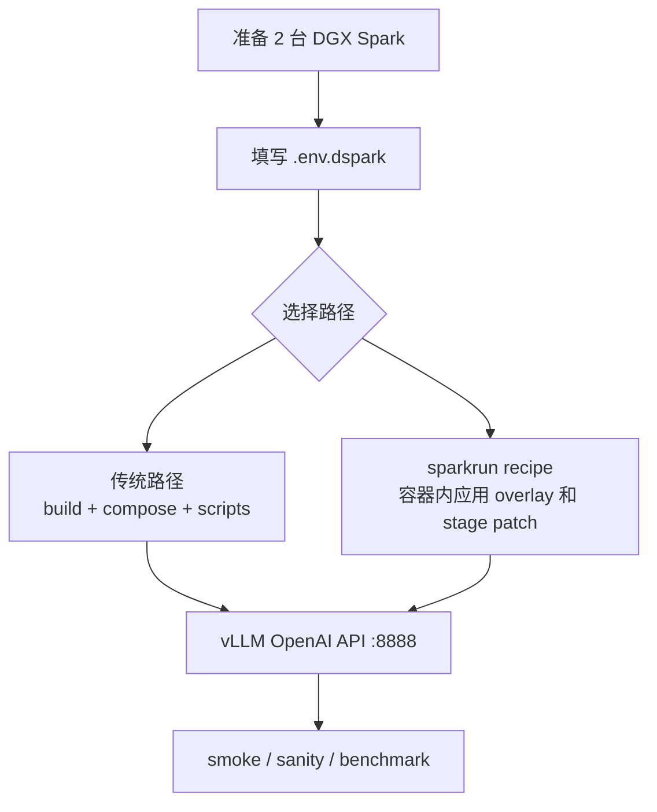

# 项目运行手册

这份文档回答：**这个仓库怎么把 DeepSeek V4 Flash / DSpark 在 2 台 DGX Spark 上跑起来**。它讲部署链路，不展开底层分布式数学；分布式推理细节见 `02-distributed-inference.md`，1M 上下文见 `03-long-context-and-kv-cache.md`，DSpark 推测解码见 `05-speculative-decoding.md`。

## 1. 项目定位

这个仓库不是普通 Python 包，而是一套面向 **2x DGX Spark / GB10** 的 vLLM 部署和验证 recipe。目标是运行 DeepSeek V4 Flash / DSpark：

- `tensor_parallel_size=2`，每台机器一个 TP rank。
- DSpark speculative decoding，默认 `MTP_NUM_TOKENS=5`。
- `nvfp4_ds_mla` KV cache，默认 `MAX_MODEL_LEN=1048576`。
- B12X MoE、FlashInfer、DeepGEMM 等面向 GB10 的运行时开关。
- overlay patch 修复并发、冷启动 garble、shared expert loader 和 reasoning stop 等问题。

## 2. 目录角色

| 路径 | 作用 |
| --- | --- |
| `README.md` | 主运行手册，包含 quick start、配置、benchmark 和排障。 |
| `DEFAULT-CONFIG.md` | 当前推荐参数和实测性能口径。 |
| `.env.dspark.example` | 双机部署变量模板，尤其是 RoCE/NCCL、cache、上下文和并发参数。 |
| `docker-compose.dspark.yml` | 传统路径的实际服务入口，最终执行 `vllm serve`。 |
| `recipe/overlay/vllm/` | 覆盖进 vLLM runtime 的源码修复。 |
| `recipe/nvfp4/` | Stage A/B/C Dockerfile，用于接入 `nvfp4_ds_mla`。 |
| `scripts/` 和顶层 `*.sh` | 构建、下载、启动、停止、状态、日志、smoke 和 sanity bench。 |
| `sparkrun/` | 另一条可复现部署路径，用 YAML recipe 编排双节点。 |
| `benchmarks/` | 历史 benchmark 和稳定性证据。 |

## 3. 两条运行路径



### 路径 A：传统脚本 + docker compose

常规流程是：

```bash
cp .env.dspark.example .env.dspark
./build-dspark-vllm-runtime.sh
./prepare-dspark-model-cache.sh
./start-deepseek-v4-flash-dspark.sh
./smoke-deepseek-v4-flash-dspark.sh
DSPARK_BASE_URL=http://HEAD:8888/v1 python3 scripts/agent_sanity_bench.py
```

关键点：

- head 和 worker 都要有同名 runtime image。
- head/worker 都要能读取完整 checkpoint。
- `start-deepseek-v4-flash-dspark.sh` 会先远程启动 worker，再启动 head。
- 对外 HTTP API 只在 head 暴露，worker 以 `HEADLESS=1` 加入 distributed engine。

### 路径 B：sparkrun recipe

`sparkrun/deepseek-v4-flash-0731-dspark-nvfp4-1m-vllm.yaml` 用 recipe 封装双节点运行：

1. 使用 digest-pinned base image。
2. 容器 `pre_exec` 拉取固定 commit 的仓库 tarball。
3. 复制 `recipe/overlay/vllm/` 到容器内 vLLM。
4. 从 Stage A/B/C Dockerfile 抽取 heredoc patch 并执行。
5. 检查关键 patch 存在后启动 `vllm serve`。

这条路径减少本地 `docker build`，但修改 Stage Dockerfile 时要同步考虑 sparkrun 的抽取逻辑。

## 4. 构建、权重和启动链路

`./build-dspark-vllm-runtime.sh` 先调用 `scripts/verify-overlay-sources.sh` 校验 Dockerfile `COPY` 源文件，再构建 overlay image 和 Stage A/B/C，最终得到类似：

```text
vllm-dspark-runtime:dspark-nvfp4-stage-c
```

`./prepare-dspark-model-cache.sh` 在容器内调用 `snapshot_download(DSPARK_MODEL)`，再读取 `model.safetensors.index.json` 校验 safetensors shard。默认也会在 worker 端重复下载/校验。注意：模型 cache 可以是节点本地或共享只读目录，但 JIT/compile cache 必须节点本地，不能让两个 rank 共享写同一个 NFS 目录。

启动脚本的关键顺序：

1. 读取 `.env.dspark` 并检查 `WORKER_HOST`、`MASTER_ADDR`、`NCCL_IB_HCA`、`NCCL_SOCKET_IFNAME`、`VLLM_HOST_IP`、`WORKER_VLLM_HOST_IP`。
2. 比较镜像内 overlay hash，发现过期则重建。
3. `scp` 同步 compose/env 到 worker。
4. worker-first 启动 `NODE_RANK=1 HEADLESS=1`。
5. head 启动 `NODE_RANK=0` 并开放 `/v1`。
6. 轮询 `/v1/models`，再发最小 chat 请求。

## 5. vLLM serve 参数链路

`docker-compose.dspark.yml` 最终执行 `vllm serve`。核心参数可以按功能理解：

| 功能 | 参数 |
| --- | --- |
| 模型和服务名 | `DSPARK_MODEL`、`SERVED_MODEL_NAME` |
| 分布式 | `--tensor-parallel-size 2`、`--nnodes 2`、`--node-rank`、`--master-addr`、`--master-port` |
| 长上下文 | `--max-model-len 1048576`、`--max-num-seqs`、`--max-num-batched-tokens` |
| KV cache | `--kv-cache-dtype nvfp4_ds_mla`、`--block-size 256` |
| DSpark | `--speculative-config '{"method":"dspark",...}'` |
| DeepSeek V4 解析 | `--tokenizer-mode deepseek_v4`、`--tool-call-parser deepseek_v4`、`--reasoning-parser deepseek_v4` |

性能关键开关很多在 environment 里，例如 `VLLM_USE_B12X_MOE=1`、`VLLM_USE_FLASHINFER_SAMPLER=1`、`VLLM_DSPARK_GPU_REJECTED_CONTEXT_MASK=1`。

## 6. Patch 和验证链路

overlay patch 是运行正确性和性能的一部分：

- Patch 1：request-stable DSpark KV slot，避免 continuous batching 串线。
- Patch 2 / 2b：处理 chunked prefill 下 ragged context。
- Patch 3：修复冷启动 prefill chunk 和 spec-token placeholder 交互导致的 garble。
- Patch 4：修复 0731 draft loader 漏载 shared expert `w1/w3`，提升 acceptance 和吞吐。
- Patch 5：避免 reasoning 段内部 stop string 导致 `content:null`。

验证顺序从轻到重：

1. `curl http://127.0.0.1:8888/v1/models`
2. `./smoke-deepseek-v4-flash-dspark.sh`
3. `DSPARK_BASE_URL=http://HEAD:8888/v1 python3 scripts/agent_sanity_bench.py`
4. `scripts/capture_runtime.sh <dir>`
5. `sparkrun/speedtest-starfall.sh` 或 `benchmarks/` 里的 benchmark。

测速时用 `stream:false` 和 `usage.completion_tokens` 计 token。spec decode 下 SSE chunk 数约等于 decode step，不等于生成 token 数。

## 7. 常见风险

- `MAX_MODEL_LEN=1048576` 是 YaRN calibrated ceiling；1.5M 是历史压力实验，不是质量承诺。
- `VLLM_USE_B12X_MOE=1` 是速度关键，关闭会退到慢路径。
- 不要添加旧的 `--override-generation-config` 或 `repetition_penalty`，这是 DSpark spec-decode crash 风险。
- `NCCL_IB_HCA`、`NCCL_SOCKET_IFNAME`、`NCCL_IB_GID_INDEX` 配错会导致 hang、慢路径或初始化失败。
- head/worker 的 `VLLM_HOST_IP` 应使用各自 fabric IP，不能让 worker 绑定到 head 的地址。
