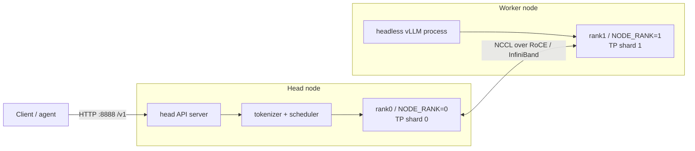
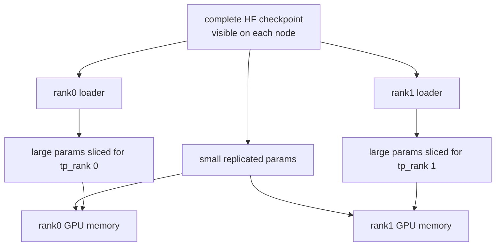
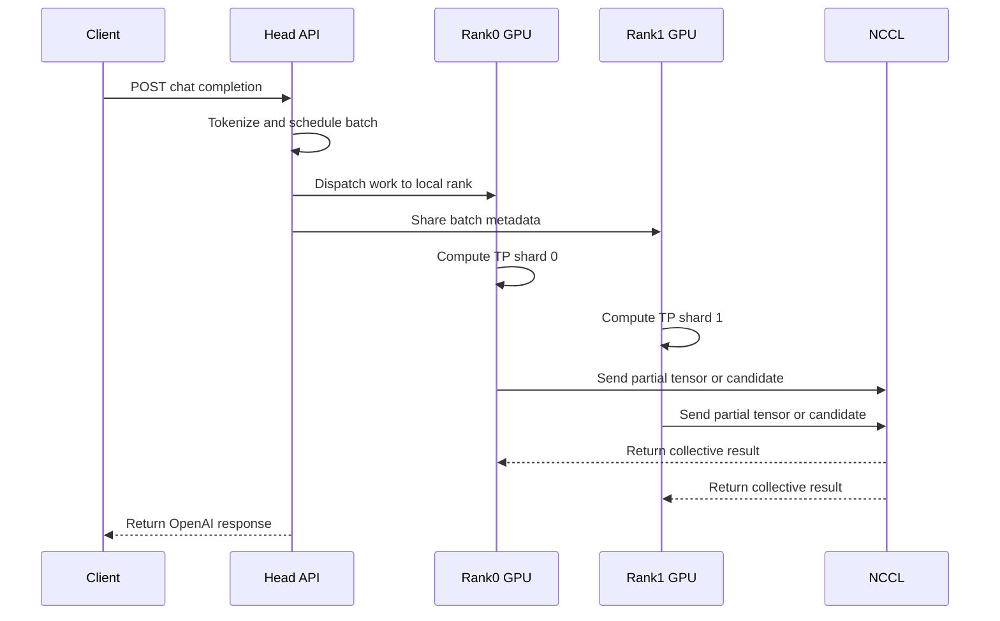
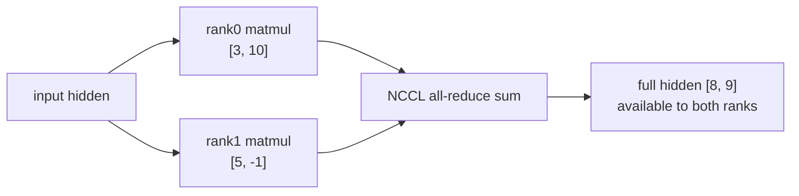
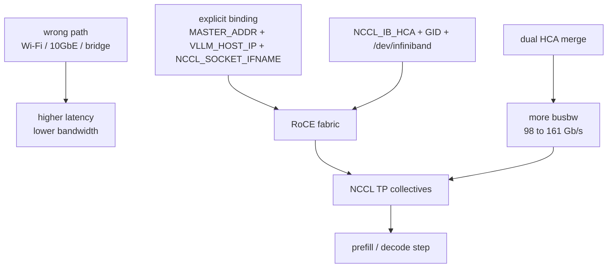

# 分布式推理详解

这份文档集中回答：**一个请求进来后，两台 DGX Spark 是否都计算、结果怎么合并、权重在两台机器上如何分布、双机之间怎么通信**。

先记结论：

- 这是一个跨两台机器的单个 vLLM tensor-parallel 服务，不是两个独立模型服务。
- 两台机器文件层都要能读取完整 checkpoint；GPU 显存里主要加载各自 TP shard。
- rank 是分布式进程组里的进程编号；本项目刚好 rank0 在 head，rank1 在 worker。
- 推理数据面走 NCCL over RoCE/InfiniBand；HTTP 只存在于 client 到 head API。
- 结果要合并，但合并的是 partial tensor 或 logits 候选，不是拼接两段自然语言。
- DSpark 推测解码如何猜 token、验 token 和计算 acceptance，见 `05-speculative-decoding.md`。

## 1. 拓扑和 rank

`docker-compose.dspark.yml` 固定了这个形态：

```bash
--tensor-parallel-size 2
--pipeline-parallel-size 1
--distributed-executor-backend mp
--nnodes 2
--node-rank ${NODE_RANK}
--master-addr ${MASTER_ADDR}
--master-port ${MASTER_PORT:-25000}
${HEADLESS:+--headless}
```

`rank` 是 distributed process group 里的进程编号。PyTorch distributed 通常用 `world_size` 表示总进程数，用 `0..world_size-1` 的 rank 标识每个进程。vLLM multi-node `mp` 后端通过 `--nnodes`、`--node-rank`、`--master-addr`、`--master-port` 把这些进程组成同一个作业。



rank0 不是“完整主模型”，rank1 也不是“备机”。rank0 多了 API server 和调度入口；rank0/rank1 都持有自己的 shard，都参与每层 forward。

## 2. 权重：完整可读，不是各下载一半

默认部署中，head 和 worker 都要能读取完整 Hugging Face checkpoint。`prepare-dspark-model-cache.sh` 会调用 `snapshot_download`，再读取 `model.safetensors.index.json`，检查 `weight_map` 里列出的 safetensors 文件是否都存在。

这里要分清两种 shard：

```text
HF / safetensors shard = checkpoint 为了存储和下载拆成多个文件
TP rank shard = vLLM 运行时为了 tensor parallel 按 rank 切出的参数片段
```

一个 safetensors 文件里可能同时包含：

- rank0 要切的 tensor。
- rank1 要切的 tensor。
- 两个 rank 都要复制的小 tensor，例如 norm、gate、scale、metadata。

所以不能简单让 head 下载前 50%、worker 下载后 50%。当前仓库没有离线生成 `rank0-only` / `rank1-only` checkpoint，而是让每个 rank 从标准完整 checkpoint 中加载自己需要的 TP slice。



显存里也不是严格 `checkpoint size / 2`。大矩阵、attention heads、MoE experts、vocab-parallel embedding/lm head 大多分片；KV cache、CUDA graph、JIT kernel、allocator reserved memory 和部分 replicated 参数不按一半计算。

## 3. 请求进入后的流程

以最小请求为例：

```json
{
  "model": "deepseek-v4-flash-dspark",
  "messages": [{"role": "user", "content": "Reply with OK."}],
  "max_tokens": 8,
  "temperature": 0
}
```

运行时序是：



prefill 阶段处理 prompt 并写入各 rank 的 KV blocks；decode 阶段逐 token 生成，每步都可能触发跨 rank collective。DSpark proposer 会预测未来 `k=5` 个 draft token，target model 在两个 rank 上共同验证；accepted token 越多，吞吐越高。

## 4. 结果怎么合并

合并不是最后把两台机器生成的文字拼起来，而是在模型内部多次同步张量。

### RowParallelLinear：all-reduce partial hidden

教学例子：某层完整 hidden 是 2 维，两个 rank 各算一部分贡献：

```text
rank0 partial hidden = [3, 10]
rank1 partial hidden = [5, -1]
```

NCCL 做 `all-reduce sum`：

```text
[3, 10] + [5, -1] = [8, 9]
```

结果是 rank0 和 rank1 都得到 `[8, 9]`，再继续下一层。



### Vocab logits：gather 候选后全局选择

假设词表大小是 100000，TP=2：

```text
rank0 负责 token 0..49999
rank1 负责 token 50000..99999
```

某一步 decode：

```text
rank0 local best = token 42, logit 8.1
rank1 local best = token 71234, logit 9.3
```

如果只看 rank0 会错选 token 42。正确流程是 gather 候选或 logits 片段后全局比较，选 token 71234。仓库 DSpark 代码里 `_vocab_parallel_argmax_from_local()` 就是先算 local top-1，再调用 `tensor_model_parallel_all_gather(local_pair, dim=-1)`。

## 5. 双机通信机制

本项目要把通信分层看：

| 层 | 使用什么 | 什么时候发生 | 传什么 |
| --- | --- | --- | --- |
| 控制面 | `ssh` / `scp` / `docker compose` | 启停 worker、同步配置 | compose、env、命令、日志 |
| 初始化面 | vLLM / PyTorch distributed | 两个 rank 加入同一个作业 | rank、地址、端口、进程组元数据 |
| 推理数据面 | NCCL over RoCE/InfiniBand | prefill/decode forward | partial hidden、logits、同步信号 |
| 存储面 | HF cache / `/models` mount | 加载权重 | checkpoint 文件 |

关键配置：

```yaml
network_mode: host
devices:
  - /dev/infiniband:/dev/infiniband
environment:
  NCCL_NET: IB
  NCCL_IB_DISABLE: 0
  NCCL_IB_HCA: ${NCCL_IB_HCA}
  NCCL_SOCKET_IFNAME: ${NCCL_SOCKET_IFNAME}
  NCCL_IB_GID_INDEX: ${NCCL_IB_GID_INDEX}
  GLOO_SOCKET_IFNAME: ${GLOO_SOCKET_IFNAME:-${NCCL_SOCKET_IFNAME}}
  TP_SOCKET_IFNAME: ${TP_SOCKET_IFNAME:-${NCCL_SOCKET_IFNAME}}
```

`WORKER_HOST` 是 SSH 目标，不一定等于推理数据面地址。真正决定 NCCL/vLLM 绑定的是 `MASTER_ADDR`、`VLLM_HOST_IP`、`WORKER_VLLM_HOST_IP`、`NCCL_IB_HCA` 和 `NCCL_SOCKET_IFNAME`。

## 6. 通信延迟和瓶颈优化

这个项目不能消除跨节点延迟，但做了几件事避免走慢路径：

| 措施 | 作用 |
| --- | --- |
| `NCCL_NET=IB`、`NCCL_IB_DISABLE=0` | 让数据面走 RoCE/IB，而不是普通 socket 慢路径。 |
| `NCCL_IB_HCA`、`NCCL_SOCKET_IFNAME` | 显式绑定 HCA 和网卡，避免选到 Wi-Fi、10GbE 或 Docker bridge。 |
| `VLLM_HOST_IP`、`WORKER_VLLM_HOST_IP`、`MASTER_ADDR` | 确保 rank 绑定各自 fabric IP。 |
| `network_mode: host`、`/dev/infiniband` | 减少容器网络地址问题，并把 RDMA/RoCE 设备暴露进容器。 |
| `NCCL_IB_MERGE_NICS=1` | 使用 DGX Spark QSFP 枚举出的双虚拟 NIC；仓库记录 busbw 约 98 Gb/s 提升到 161 Gb/s。 |
| worker-first 启动 | 降低 rendezvous 竞态和 bootstrap 重试，不是直接降低每 token latency。 |
| prefix caching、async scheduling、chunked prefill | 降低端到端排队和重复 prefill，不改变单次 NCCL collective 延迟。 |



`DEFAULT-CONFIG.md` 还提醒 GB10 没有 GPUDirect RDMA，因此跨节点 decode collective 仍可能是上限之一；这些配置是在降低瓶颈，不是在消除瓶颈。

## 7. 为什么常用 2 台 DGX Spark

DGX Spark 的价值来自本地大 unified memory 和高速互联的组合：

- 单台 Spark 有 128GB unified memory，适合本地承载大模型实验。
- DeepSeek V4 Flash 是 MoE，官方资料写 Flash 约 284B total / 13B active；active 低不代表只加载 13B 权重。
- NVIDIA 把单台 Spark 定位到 up to 200B 级模型，双 Spark 定位到 up to 405B 级模型。
- 双机不是透明 256GB unified memory，而是两个本地 128GB 节点通过 TP=2 分摊权重、KV 和 workspace。
- ConnectX-7 / QSFP / RoCE 让跨节点 collective 更现实。

参考资料：

- PyTorch Distributed：`https://docs.pytorch.org/docs/2.13/distributed.html`
- vLLM serve：`https://docs.vllm.ai/en/v0.11.1/cli/serve/`
- NVIDIA NCCL env：`https://docs.nvidia.com/deeplearning/nccl/user-guide/docs/env.html`
- NVIDIA DGX Spark：`https://www.nvidia.com/en-us/products/workstations/dgx-spark/`

## 8. 排障心智模型

- API 通但推理卡住：先查 worker 是否加入 distributed group，`MASTER_ADDR` / `MASTER_PORT` 是否一致。
- NCCL 初始化失败：查 `NCCL_IB_HCA`、`NCCL_SOCKET_IFNAME`、`NCCL_IB_GID_INDEX`、MTU 和 `/dev/infiniband`。
- 性能只有预期一半：查是否只用了一个 HCA，是否设置 `NCCL_IB_MERGE_NICS=1`，是否走了错误网卡。
- 输出乱码或 empty content：不要先归因通信；分别查 DSpark proposer、cold-start garble、reasoning stop、loader 和上层 client 字段读取。

一句话记忆：**文件层完整可读，显存层 TP 分片；head 接请求，worker 参与算；控制面 SSH，数据面 NCCL；合并张量，不合并文字。**
