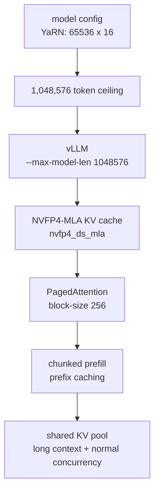

# 1M 上下文和 KV Cache 机制

这份文档集中回答：**本项目的 1M context 是怎么实现的，为什么不是简单把参数调大，以及并发和 KV pool 是什么关系**。

核心结论：

- `1048576` 来自模型 YaRN 配置，是推荐的 calibrated ceiling。
- vLLM 用 `--max-model-len 1048576` 放开单请求上限。
- 长上下文的主要运行时压力是 KV cache，不是 checkpoint 文件本身。
- 本项目用 DeepSeek V4 sparse MLA 适配的 `nvfp4_ds_mla`、PagedAttention、chunked prefill 和 prefix caching 一起降低 KV 压力。
- `max_num_seqs=6` 不代表 6 个请求都能同时满 1M；真正限制是所有活跃请求的 live tokens 总量。

## 1. 一张总图



1M 不是某个单点 patch，而是模型配置、vLLM 参数、KV cache dtype 和内存分配策略一起成立。

## 2. 模型本身的上限

README 记录的关键配置是：

```text
original_max_position_embeddings=65536
factor=16
max_position_embeddings=1048576
```

也就是：

```text
65536 x 16 = 1,048,576
```

所以 `MAX_MODEL_LEN=1048576` 是对齐 YaRN 校准范围的选择。历史记录里跑过 1.5M，但那是压力测试或探索，不应承诺超过 1M 后仍然有同等质量。

## 3. vLLM 如何放开单请求长度

`docker-compose.dspark.yml` 里传入：

```bash
--max-model-len ${MAX_MODEL_LEN:-1048576}
```

`.env.dspark.example` 默认也是：

```bash
MAX_MODEL_LEN=1048576
```

这两个设置只说明服务端允许单个请求最长到 1M tokens。它不代表每个并发请求都会预留 1M，也不代表机器能同时容纳任意数量的 1M 请求。

## 4. KV cache 为什么是关键

checkpoint 权重是启动时加载的模型参数；KV cache 是请求运行时产生的 attention/MLA 缓存。长 prompt 会产生大量 KV blocks，decode 阶段每生成一步还要继续使用这些缓存。

本项目的关键配置：

```bash
--kv-cache-dtype ${KV_CACHE_DTYPE:-nvfp4_ds_mla}
--block-size 256
```

`nvfp4_ds_mla` 是仓库 Stage A/B/C patch 接入的 DeepSeek V4 sparse MLA KV cache 路径。名字里的 `nvfp4` 表示 KV 存储/量化方向，`ds_mla` 表示它不是通用 KV cache，而是服务 DeepSeek V4 MLA attention 的专用布局。

- Stage A：把 `nvfp4_ds_mla` 加入 dtype / quant mode plumbing。
- Stage B：让 DeepSeek V4 sparse MLA 接受该 dtype。
- Stage C：切到验证过的 584-byte padded KV envelope。

直观理解：

```text
普通长上下文瓶颈: KV cache 太大
本项目做法: DeepSeek V4 sparse MLA + NVFP4 KV layout + PagedAttention block 管理
结果: 在 2x DGX Spark 上让 1M context 成为可运行配置
```

## 5. 四个组件各自解决什么问题

这几个词不要当成并列 buzzword，它们解决的是长上下文链路里的不同压力点：

| 组件 | 解决的问题 | 在本项目里的作用 |
| --- | --- | --- |
| `nvfp4_ds_mla` | 长上下文下 MLA KV cache 太占显存 | 给 DeepSeek V4 sparse MLA 接入 NVFP4 KV cache 格式，扩大可用 KV pool，是 1M context 的核心内存杠杆。 |
| PagedAttention | KV cache 不能按最大长度静态预留 | 把 KV cache 拆成 block，按活跃 token 动态分配和回收，让短请求不为 1M 上限提前占满显存。 |
| Chunked Prefill | 超长 prompt 一次性 prefill 会占用巨大 batch 和内存 | 把 prompt prefill 分块调度，配合 `--max-num-batched-tokens` 控制单轮 token 数，让长 prompt 和其他请求更平滑地共存。 |
| Prefix Caching | agent/system prompt、工具说明等重复前缀会反复 prefill | 复用相同前缀对应的 KV blocks，减少重复计算和 KV 写入。 |

所以更准确的简历说法是 **NVFP4-MLA KV Cache (`nvfp4_ds_mla`)**，而不是只写 **NVFP4 KV Cache**。前者能体现这个项目接的是 DeepSeek V4 MLA 的专用 KV 路径。

## 6. PagedAttention 和共享 KV pool

vLLM 不会按下面这种方式预分配：

```text
max_num_seqs x max_model_len
```

更接近下面这个约束：

```text
sum(live tokens across active requests) <= KV pool
```

也就是说，`max_model_len` 是单请求上限，`max_num_seqs` 是 scheduler 同时活跃序列上限；真正能不能放下，取决于活跃请求当前实际 token 总数。

例子：

| 请求形态 | live tokens 总量 | 解释 |
| --- | ---: | --- |
| 6 个请求各 50K | 300K | 普通 agent 并发形态，通常压力较小。 |
| 6 个请求各 200K | 1.2M | 开始明显消耗 KV pool，但仍可能可行。 |
| 2 个请求各 1M | 2.0M | 接近或超过 1M 配置的满上下文并发边界。 |
| 6 个请求各 1M | 6.0M | 不应期待同时驻留，会排队、preempt 或失败。 |

boot log 里类似：

```text
Maximum concurrency for 1,048,576 tokens per request: 1.81x
```

的意思是“如果每个请求都满 1M，大约能容纳 1.81 个”，不是说短请求只能并发 1.81 个。

## 7. 1M、并发和吞吐的关系

长上下文会影响两个阶段：

| 阶段 | 主要压力 | 本项目相关设置 |
| --- | --- | --- |
| prefill | prompt token 多，KV 写入量大 | `--enable-chunked-prefill`、`--max-num-batched-tokens`、prefix caching、`nvfp4_ds_mla` |
| decode | 每步都要读 KV，并跨 rank collective | DSpark speculative decoding、NCCL/RoCE、B12X MoE |

DSpark 的吞吐不是只看 decode step/s，而要看每步能接受多少 draft token：

```text
tokens/s = decode steps/s x accepted tokens per step
```

这解释了为什么 shared expert loader 修复能显著提高吞吐：target model 仍保证输出正确，但 draft acceptance 下降会让 speculative decoding 退化。DSpark 的猜 token、验 token 和 acceptance 口径见 `05-speculative-decoding.md`。

## 8. 为什么不默认 1.5M

仓库历史里有超过 1M 的实验，但默认应坚持 `1048576`：

- 1M 是模型配置校准出的范围。
- 1.5M 超过 YaRN calibrated ceiling，输出质量不能按 1M 承诺。
- 更长上下文会挤压 KV pool，降低满上下文并发余量。
- benchmark 上“能启动、能测 tok/s”不等于生产上可稳定使用。

需要对外表述时，推荐说：

> 本项目默认支持 1M 上下文，因为它对齐模型 YaRN ceiling，并通过 NVFP4-MLA KV Cache (`nvfp4_ds_mla`)、PagedAttention、chunked prefill 和 prefix caching 管理内存与预填充压力。1.5M 是历史压力实验，不作为质量保证。

## 9. 常见误解

| 误解 | 正确说法 |
| --- | --- |
| `MAX_MODEL_LEN=1M` 是任意调大的 | 不是，它对齐 DeepSeek V4 Flash 的 YaRN ceiling。 |
| `max_num_seqs=6` 表示 6 个请求都能满 1M | 不是，KV pool 看活跃 token 总数。 |
| 1M 主要靠权重分片实现 | 不准确。权重分片解决模型参数容量，1M 主要吃 KV cache。 |
| KV cache 会在两台机器合成一份 | 不会。每个 TP rank 维护本 rank 需要的 KV blocks。 |
| 1.5M 和 1M 一样可靠 | 不应这样承诺，1.5M 超出校准范围。 |

一句话记忆：**1M = YaRN ceiling + vLLM max_model_len + nvfp4_ds_mla + PagedAttention + chunked prefill + prefix caching；并发边界看 live tokens 总量，不看 max_num_seqs x 1M。**
