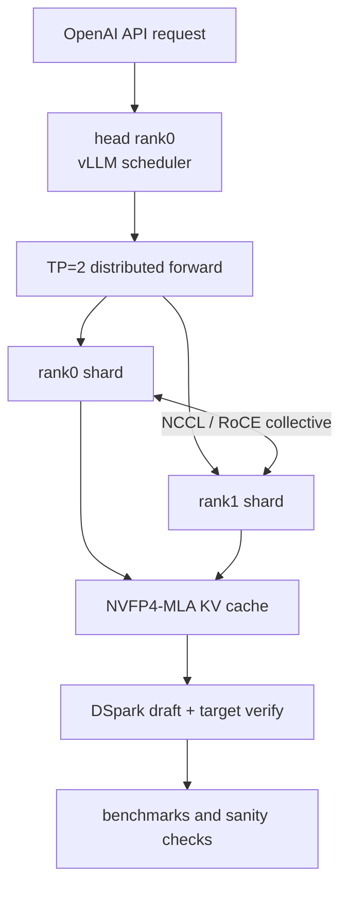

# 面试讲解手册

这份文档用于把本仓库转化成求职面试里的技术叙事。原则是：讲清楚系统边界、工程难点、定位方法和可复现证据；不要把 DeepSeek、vLLM 或 DGX Spark 的上游能力说成自己的发明。

## 1. 30 秒项目介绍

可以这样说：

> 这个项目是在 2 台 DGX Spark 上部署和验证 DeepSeek V4 Flash / DSpark 的分布式推理 recipe。它把模型以 TP=2 跑在 vLLM 上，rank0 在 head 节点对外提供 OpenAI-compatible API，rank1 在 worker 节点 headless 参与推理；双机数据面通过 NCCL over RoCE/InfiniBand 做 tensor collective。项目还支持默认 1M context，并围绕 DSpark speculative decoding、NVFP4-MLA KV Cache (`nvfp4_ds_mla`)、并发稳定性、冷启动 garble 和真实 agent benchmark 做了系统化修复和验证。

收束句：

> 它不是简单拉起一个模型，而是把双机推理、长上下文、spec decode、KV cache、网络配置和稳定性验证串成了一套可复现工程 recipe。

## 2. 亮点地图

## 3. 四个主亮点

| 亮点 | 面试中体现的能力 | 可引用材料 |
| --- | --- | --- |
| 双机分布式推理 | 能解释 TP=2、rank、权重可见性、GPU shard、NCCL 合并 | `explain/02-distributed-inference.md` |
| 1M 上下文 | 能区分 YaRN ceiling、`max_model_len`、KV dtype、PagedAttention 和并发边界 | `explain/03-long-context-and-kv-cache.md` |
| DSpark/vLLM 调试 | 能定位 speculative decoding、continuous batching、ragged context、prefill placeholder、shared expert loader | `explain/05-speculative-decoding.md`、`docs/PATCHES.md`、`DSPARK-SHARED-EXPERT-FIX.md` |
| 可复现验证 | 能用 smoke、sanity、runtime capture、benchmark 说明修复有效 | `README.md`、`DEFAULT-CONFIG.md`、`benchmarks/` |

## 4. 可展开故事

### 故事 A：双机不是两份模型拼答案

重点说清四层：

- 文件层：两台机器都要能读取完整 checkpoint。
- 显存层：大权重主要按 TP rank 分片，不是两张 GPU 各完整复制。
- 通信层：推理中间结果通过 NCCL/RoCE all-reduce 或 all-gather。
- API 层：只有 head 对外接 HTTP，worker 没有 API 但参与计算。

一句话：

> 合并的是 hidden、logits 或 token 候选，不是合并两段文本。

### 故事 B：1M context 不是简单调大参数

`1048576` 来自 `65536 x 16` 的 YaRN 配置。vLLM 用 `--max-model-len 1048576` 放开单请求上限，真正让它可运行的是 NVFP4-MLA KV Cache (`nvfp4_ds_mla`)、PagedAttention block 管理、chunked prefill、prefix caching 和双机 TP 留出的内存余量。

要主动说清：

- `max_num_seqs=6` 不是 6 个请求都满 1M。
- KV pool 看 `sum(live tokens across active requests)`。
- 1.5M 是历史压力实验，不是默认质量承诺。

### 故事 C：并发 bug 体现对 vLLM 调度语义的理解

可以按 STAR 讲：

- Situation：`--max-num-seqs > 1` 后，并发请求触发异常或错误 draft context。
- Task：让 DSpark proposer 在 continuous batching 和 chunked prefill 下仍然正确。
- Action：引入 request-stable KV slot，不把 batch row 当稳定身份；用 `query_start_loc` 处理 ragged context。
- Result：并发路径从偶发崩溃变成可验证运行，并能支撑后续 c6 benchmark。

### 故事 D：shared expert loader 修复提升 acceptance

`DSPARK-SHARED-EXPERT-FIX.md` 记录了 0731 DSpark draft loader 漏载 always-on shared expert 的问题。它不会必然让最终输出立刻坏，因为 target model 仍负责验证；但 draft acceptance 会下降，吞吐明显受损。

可讲指标：

- mean decode 从 **32.7 tok/s** 提升到 **55.4 tok/s**。
- draft acceptance 从 **25.7%** 提升到 **60.2%**。

这能体现你把模型结构、权重命名、loader 行为和性能指标联系起来。

## 5. 常见追问回答

### 权重是在两台机器都下载吗？

默认是的，或者至少两台机器都要能读到完整 checkpoint。每个 rank 启动时从标准 checkpoint 加载自己的 TP shard。不要说“head 下载前半，worker 下载后半”；应说“文件层完整可见，GPU 层按 TP 分片”。

### 两台机器都计算，那结果是不是要合并？

要合并，但不是合并自然语言。row-parallel 层会 all-reduce partial hidden；vocab-parallel logits 会 gather 候选或 logits 片段再做全局选择。最终 head 返回同一个 token 序列。

### rank0 和 rank1 的 rank 是什么？

rank 是分布式进程组里的进程编号，不是主从关系。本项目 `world_size=2`：head 是 `NODE_RANK=0`，worker 是 `NODE_RANK=1 HEADLESS=1`。rank0 多了 API server；两者都参与 TP forward。

### 项目如何降低双机通信延迟？

它主要避免走慢路径：显式设置 `NCCL_IB_HCA`、`NCCL_SOCKET_IFNAME`、`VLLM_HOST_IP`、`WORKER_VLLM_HOST_IP`，让数据面走 NCCL over RoCE/IB；使用 `network_mode: host` 和 `/dev/infiniband`；双 HCA 场景用 `NCCL_IB_MERGE_NICS=1`。worker-first 解决启动 rendezvous 竞态，不是直接降低 token latency。

### 为什么很多方案用 2 台 DGX Spark？

DeepSeek V4 Flash 是大 MoE，active params 低不等于只加载 active 权重。单台 Spark 有 128GB unified memory，双 Spark 通过 TP=2 分摊权重、KV 和 workspace，并用 ConnectX-7/RoCE/NCCL 承担跨节点 collective。它不是透明的 256GB unified memory。

### 如何证明不是只跑通 demo？

引用 smoke test、`agent_sanity_bench.py`、runtime capture、并发 benchmark、冷启动失败率对比和真实 agent traffic。回答时强调固定变量、记录口径、复现脚本和失败率。

## 6. 不要这样讲

- 不要说“我实现了 DeepSeek”或“我发明了 vLLM”。更准确是部署、适配、修复和验证。
- 不要说“两台机器各自输出一半文字再拼接”。
- 不要说“6 个并发请求都能各自满 1M”。
- 不要把 1.5M 描述成质量保证。
- 不要把 streaming chunk 数当 tok/s；spec decode 下 chunk 数更接近 decode step。
- 不要只背 benchmark 数字；要说明硬件、配置、prompt 类型、冷/热状态和统计口径。

## 7. 两分钟技术深挖模板

1. 系统入口：head 提供 OpenAI-compatible API，worker 由脚本和 compose 拉起。
2. 分布式执行：TP=2，rank0/rank1 共同 forward，NCCL/RoCE 做 all-reduce/all-gather。
3. 权重和显存：文件层完整 checkpoint 可读，GPU 层主要大权重按 TP shard 加载。
4. 长上下文：`max_model_len=1048576` 对齐 YaRN ceiling，KV cache 靠 `nvfp4_ds_mla`、PagedAttention、chunked prefill 和 prefix caching 管理。
5. DSpark 加速：draft model 生成候选，target model 验证，acceptance 决定吞吐。
6. 修复与验证：处理并发、ragged context、冷启动 garble、shared expert loader，并用 benchmark 证明。

面试收尾句：

> 这个项目最能体现的是：我不仅能把大模型服务跑起来，还能解释双机推理的数据流，定位 vLLM 调度和 KV cache 相关问题，用 benchmark 证明修复有效，并把整套部署过程沉淀成别人可以复现的工程 recipe。
