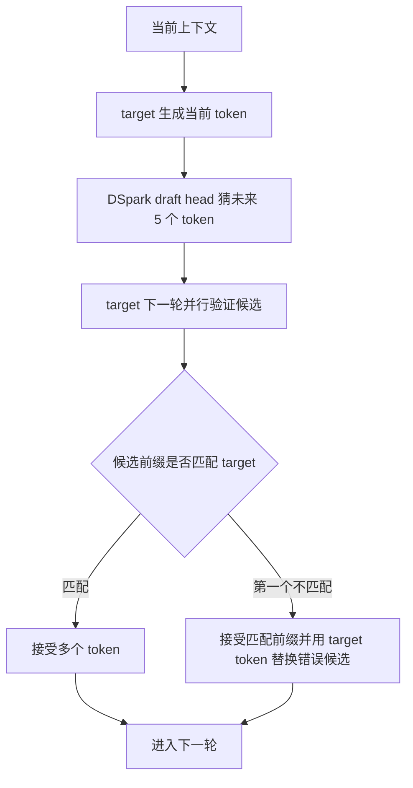
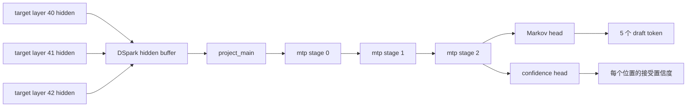
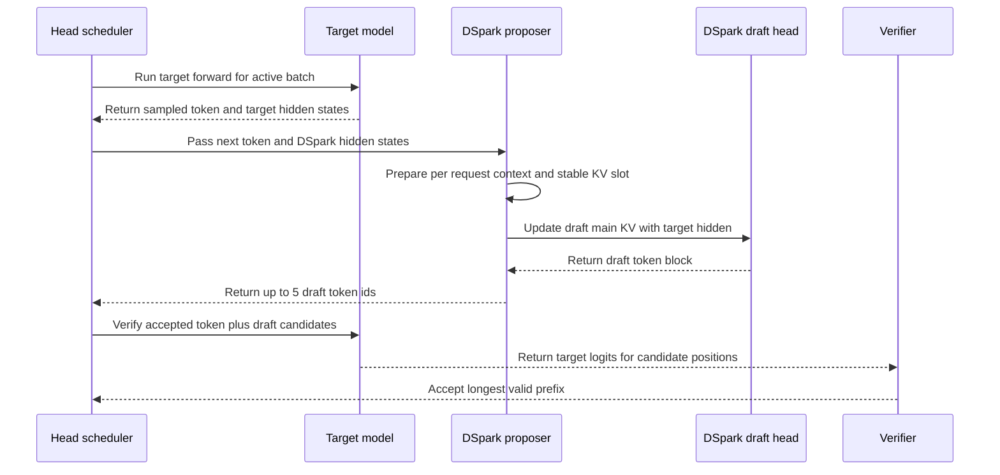
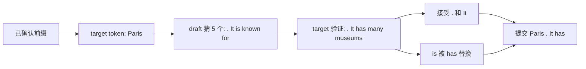
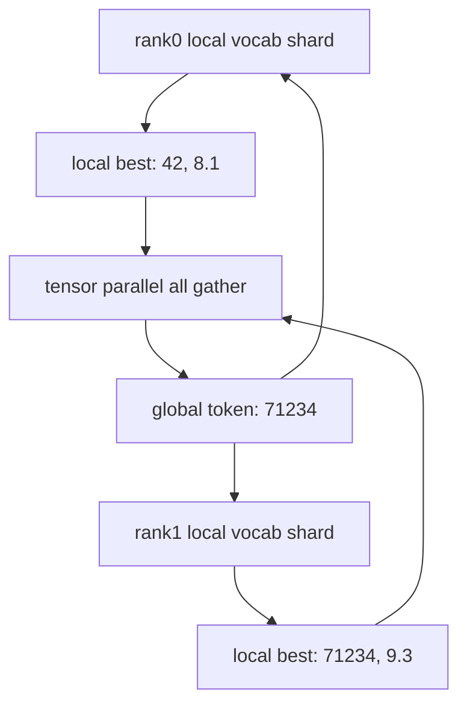
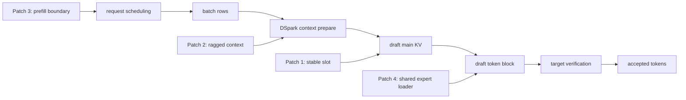

# DSpark 推测解码机制详解

这份文档集中回答：**本项目的推测解码怎么工作，一个请求进来后 DSpark 猜了什么、target model 验证了什么、双机结果如何同步，以及为什么 acceptance 直接决定吞吐**。

先记结论：

- 本项目不是外接一个小 draft 模型，而是使用 checkpoint 内置的 DSpark draft head。
- `docker-compose.dspark.yml` 通过 `--speculative-config '{"method":"dspark",...}'` 开启 DSpark。
- 当前仓库默认 `MTP_NUM_TOKENS=5`，也就是每轮最多提交 5 个 draft token 给 target 验证。
- target model 仍然负责最终验证，所以 draft 猜错通常损失速度，不直接污染最终输出。
- 双机 TP 下，rank0/rank1 都参与 target 和 draft 计算；同步的是 tensor、logits 候选和 token 决策，不是两台机器各自生成文字后拼接。

## 1. 普通 decode 和推测 decode

普通 decode 每轮 target model 只确认一个新 token：

```text
prompt -> target step 1 -> token A
      -> target step 2 -> token B
      -> target step 3 -> token C
```

推测解码的核心是：先让便宜的 draft 路径猜未来几个 token，再让昂贵的 target model 一次性验证这些候选。



这里的“无损”不是指输出字节完全不变，而是指 target model 对候选 token 做验证；draft 不被信任为最终答案，只是加速候选生成。

## 2. 本项目如何打开 DSpark

`.env.dspark.example` 默认：

```bash
MTP_NUM_TOKENS=5
VLLM_DSPARK_CONFIDENCE_THRESHOLD=0.0
VLLM_DSPARK_CONFIDENCE_SCHEDULER=off
VLLM_DSPARK_LOCAL_ARGMAX=1
VLLM_DSPARK_GPU_REJECTED_CONTEXT_MASK=1
```

`docker-compose.dspark.yml` 运行时拼出：

```bash
SPECULATIVE_CONFIG="{\"method\":\"dspark\",\"num_speculative_tokens\":${MTP_NUM_TOKENS:-5},\"draft_sample_method\":\"probabilistic\"}"
...
vllm serve ... --speculative-config "$SPECULATIVE_CONFIG"
```

注意几个容易混淆的点：

| 配置 | 当前解释 |
| --- | --- |
| `method: dspark` | 使用 DeepSeek / NVIDIA checkpoint 内置 DSpark draft head。 |
| `num_speculative_tokens: 5` | 每轮最多验证 5 个 draft token；这是本仓库当前默认。 |
| `draft_sample_method: probabilistic` | 保留在配置中；但 `DEFAULT-CONFIG.md` 顶部已经更正：当前 DSpark 路径下这个字段基本不决定 acceptance，冷启动 garble 主要由 Patch 3 修复。 |
| 没有单独 `model` 字段 | `recipe/overlay/vllm/config/speculative.py` 对 `method in ("mtp", "dspark")` 会复用 target model 路径，因为 draft head 在同一个 checkpoint 里。 |

所以本项目不是“下载一个 DeepSeek target，再下载一个 draft 小模型”。它是同一个 checkpoint 里同时有 target 权重和 DSpark draft 模块。

## 3. DSpark draft head 的结构

从 NVIDIA model card 和本仓库 overlay 代码看，这个 DSpark 模块可以理解为 target model 后面挂了一个半自回归 draft head：



对应仓库代码：

- `recipe/overlay/vllm/models/deepseek_v4/nvidia/model.py` 把 target 层 hidden states 写入 `_dspark_hidden_buffer`。
- `recipe/overlay/vllm/models/deepseek_v4/nvidia/dspark.py` 的 `DeepSeekV4DSparkModel.prefill_main()` 把 target hidden 投影后写入 DSpark 自己的 main KV cache。
- 同文件的 `draft()` 构造长度为 `dspark_block_size` 的 draft block，第一列放当前 token，其余位置先填 `noise_token_id`，然后通过 DSpark layer、Markov head 和 confidence head 输出候选。

`draft()` 里最关键的一段逻辑是：

```text
input_ids = 当前已确认 token
draft_input_ids[:, 0] = input_ids
draft_positions = 当前 position + [0, 1, 2, 3, 4]
output_ids[:, pos + 1] = argmax(logits_at_pos + markov_bias)
return output_ids[:, 1:]
```

也就是说，DSpark 不是简单并行预测 5 个互不相关的位置；Markov head 会把前一个 draft token 的信息注入后一个位置，让 block 内 token 之间有依赖。

## 4. 一个请求的一轮运行时序

以下是 decode 阶段一轮的抽象时序：



这里有一个重要细节：vLLM spec decode 通常按“本轮 target 结果 + 本轮 draft 候选”组织流水。target 当前确认的 token 可以看成 bonus token；draft 候选会在下一次 target verification 中被验证。benchmark 里不能只数 decode step，要数最终 accepted completion tokens。

## 5. 具体例子：一次猜 5 个 token

假设当前 prompt 是：

```text
The capital of France is
```

某轮 target 已经确认下一个 token 是：

```text
 Paris
```

DSpark 看到当前 token、position 和 target hidden 后，一次猜 5 个候选：

```text
draft = [".", " It", " is", " known", " for"]
```

下一轮 target model 并行验证这些位置。假设 target 的真实偏好是：

```text
target = [".", " It", " has", " many", " museums"]
```

那么接受过程是：

| 位置 | draft | target | 结果 |
| --- | --- | --- | --- |
| 1 | `.` | `.` | 接受 |
| 2 | ` It` | ` It` | 接受 |
| 3 | ` is` | ` has` | 拒绝，从这里停止 |
| 4 | ` known` | 不再看 | 丢弃 |
| 5 | ` for` | 不再看 | 丢弃 |

本轮最终提交：

```text
 Paris . It has
```

其中 `Paris` 是 target 当前确认的 token，`.` 和 ` It` 是被接受的 draft token，` has` 是第一个不匹配位置由 target 给出的替换 token。后面的 `known for` 被丢弃。



## 6. acceptance 如何变成吞吐

vLLM 的 acceptance 指标可以这样理解：

```text
mean_acceptance_length = 1 + accepted_draft_tokens / spec_decode_steps
draft_acceptance_rate = accepted_draft_tokens / drafted_tokens
tokens_per_second ~= decode_steps_per_second * mean_acceptance_length
```

例子：`k=5`，跑了 20 个 spec decode steps，每步都最多猜 5 个 draft token，总共猜了 100 个 draft token。如果其中 60 个被 target 接受：

```text
draft_acceptance_rate = 60 / 100 = 60%
mean_acceptance_length = 1 + 60 / 20 = 4.0 tokens/step
```

如果机器每秒能跑 14.0 个 target verification step：

```text
tokens/s ~= 14.0 * 4.0 = 56.0
```

这解释了 `DSPARK-SHARED-EXPERT-FIX.md` 里的现象：修 shared expert loader 之后，单步计算速度没有神奇翻倍，但 draft 更接近 target，接受率从约 25.7% 提到约 60.2%，最终 tok/s 从约 32.7 提到约 55.4。

| 状态 | draft acceptance | mean decode |
| --- | ---: | ---: |
| shared expert 漏载 | 25.7% | 32.7 tok/s |
| Patch 4 后 | 60.2% | 55.4 tok/s |

所以排查 spec decode 性能时，要先判断是：

- **step 慢**：NCCL、MoE backend、KV cache、CUDA graph 或网络问题。
- **acceptance 低**：draft 权重、loader、上下文对齐、采样路径或 prompt 类型问题。

## 7. 双机 TP 下会不会“合并结果”

会合并，但不是合并两段文字。

本项目 `--tensor-parallel-size 2`，rank0 和 rank1 都会跑 target shard，也都会跑 DSpark draft shard。对于 vocab-parallel 的 token 选择，两个 rank 各自只看到本地词表分片的 logits，需要通信后选全局最优 token。

教学例子：

```text
rank0 local best = token 42, logit 8.1
rank1 local best = token 71234, logit 9.3
```

仓库 `recipe/overlay/vllm/models/deepseek_v4/nvidia/dspark.py` 里的 `_vocab_parallel_argmax_from_local()` 会把每个 rank 的本地候选 `all_gather` 起来，再选 logit 最大的全局 token：

```text
global best = token 71234
```



因此，单个请求确实两台机器都计算；但它们共同维护的是同一个 batch、同一个 token 序列和同一套 verification 决策。

## 8. 为什么几个 patch 都和推测解码相关

| Patch | 推测解码里的问题 | 修复意义 |
| --- | --- | --- |
| Patch 1 | DSpark main KV cache 原来按 batch row 索引；continuous batching 会让 row 对应到不同 request。 | 改成 request-stable KV slot，避免并发串上下文。 |
| Patch 2 / 2b | chunked prefill + decode 混合时，每个 request 的 query row 数不同，不能硬 reshape 成矩形。 | 用 `query_start_loc` 走 ragged path，正确找到每个 request 的 anchor hidden。 |
| Patch 3 | prefill chunk 阶段不该塞 speculative placeholder；否则冷启动并发可能 garble。 | 让 prefill 和 speculative decode 边界更清楚。 |
| Patch 4 | DSpark draft loader 漏载 always-on shared expert 的 `w1/w3`。 | target 输出仍正确，但 draft 猜得差，acceptance 和吞吐塌陷；补 loader mapping 后恢复。 |

对应流程位置：



## 9. 调参和观测口径

本仓库当前建议：

- 保持 `MTP_NUM_TOKENS=5`。DeepSeek/NVIDIA 文档里有 `k=7` 建议，但当前仓库记录的运行时 drafter 每 pass 发 5 个 token；强行改 7 会遇到 block size 不匹配或生成时崩溃风险。
- 不要重新加入旧的 `--override-generation-config` / `repetition_penalty`。仓库注释把它标为 DSpark spec-decode crash 风险。
- benchmark 用 `stream:false` 和 `usage.completion_tokens` 统计。spec decode 下 SSE chunk 更接近 decode step，不等于生成 token 数。
- 观察 vLLM speculative metrics 时，把 `draft_acceptance_rate`、`mean_acceptance_length`、`num_spec_steps` 和真实 tok/s 放在一起看。

一句话记忆：**DSpark 用 target hidden 驱动 checkpoint 内置 draft head 一次猜 5 个 token；target 下一轮并行验证候选，接受越多，每个昂贵 target step 产出的真实 token 越多。**

## 10. 参考来源

- 本仓库：`docker-compose.dspark.yml`、`.env.dspark.example`、`DEFAULT-CONFIG.md`、`DSPARK-SHARED-EXPERT-FIX.md`、`docs/PATCHES.md`。
- 本仓库 overlay：`recipe/overlay/vllm/v1/spec_decode/dspark_proposer.py`、`recipe/overlay/vllm/models/deepseek_v4/nvidia/dspark.py`、`recipe/overlay/vllm/config/speculative.py`。
- vLLM speculative decoding docs: https://docs.vllm.ai/en/latest/features/speculative_decoding/
- vLLM acceptance metrics docs: https://docs.vllm.ai/en/latest/features/speculative_decoding/acceptance_metrics/
- NVIDIA DeepSeek-V4-Flash-nvfp4-DSpark model card: https://huggingface.co/nvidia/DeepSeek-V4-Flash-nvfp4-DSpark
- DeepSeek DSpark model card: https://huggingface.co/deepseek-ai/DeepSeek-V4-Flash-DSpark
