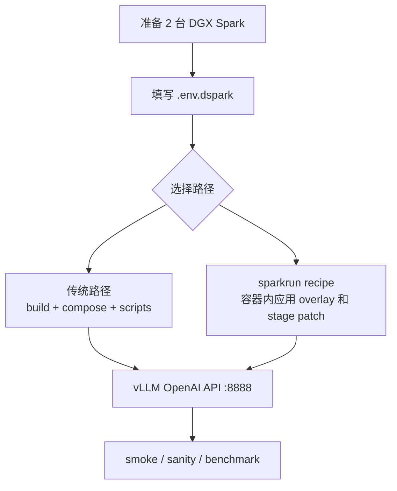

# 系统总览

这份文档回答：**这个仓库把 DeepSeek V4 Flash / DSpark 部署成一个什么样的系统，系统边界在哪里**。它只讲系统定位和边界，不展开部署步骤与运维细节；分布式推理见 `02-distributed-inference.md`，1M 上下文见 `03-long-context-and-kv-cache.md`，DSpark 推测解码见 `04-speculative-decoding.md`。

## 1. 项目定位

这个仓库不是普通 Python 包，而是一套面向 **2x DGX Spark / GB10** 的 vLLM 部署、适配和验证 recipe，目标是把 DeepSeek V4 Flash / DSpark 跑成一套可复现的双机推理服务：

- `tensor_parallel_size=2`，每台机器一个 TP rank，对外是**一个服务**而不是两个。
- DSpark speculative decoding，默认 `MTP_NUM_TOKENS=5`。
- `nvfp4_ds_mla` KV cache，默认 `MAX_MODEL_LEN=1048576`。
- B12X MoE、FlashInfer、DeepGEMM 等面向 GB10 的运行时开关。
- overlay patch 修复并发、冷启动 garble、shared expert loader 和 reasoning stop 等问题。

一句话边界：本项目做的是**部署、适配、修复和验证**，不是发明 DeepSeek、vLLM 或 DGX Spark 的上游能力。

## 2. 系统边界

| 维度 | 本项目负责 | 不属于本项目 |
| --- | --- | --- |
| 模型 | 部署官方 checkpoint，适配 DSpark draft head | 训练模型、生成权重 |
| 推理框架 | 用 vLLM 跑 TP=2，修 overlay 层 bug | 实现 vLLM 框架本体 |
| 硬件/网络 | 配置 2x DGX Spark 的 NCCL/RoCE、双机启动 | 设计 GPU 或互联硬件 |
| 交付形态 | 可复现 recipe + 双机脚本 + benchmark 证据 | 托管 SaaS 或模型能力本身 |

## 3. 目录角色

| 路径 | 作用 |
| --- | --- |
| `README.md` | 主运行手册，包含 quick start、配置、benchmark 和排障。 |
| `DEFAULT-CONFIG.md` | 当前推荐参数和实测性能口径。 |
| `.env.dspark.example` | 双机部署变量模板，尤其是 RoCE/NCCL、cache、上下文和并发参数。 |
| `docker-compose.dspark.yml` | 传统路径的实际服务入口，最终执行 `vllm serve`。 |
| `recipe/overlay/vllm/` | 覆盖进 vLLM runtime 的源码修复。 |
| `recipe/nvfp4/` | Stage A/B/C Dockerfile，用于接入 `nvfp4_ds_mla`。 |
| `scripts/` 和顶层 `*.sh` | 构建、下载、启动、停止、状态、日志、smoke 和 sanity bench。 |
| `sparkrun/` | 另一条可复现部署路径，用 YAML recipe 编排双节点。 |
| `benchmarks/` | 历史 benchmark 和稳定性证据。 |

## 4. 两条运行路径

- **路径 A（docker compose + 脚本）**：`build` 出 Stage C NVFP4 镜像 → 准备模型 cache → worker-first 启动 → smoke/sanity 验证。head 和 worker 需同名镜像、都能读取完整 checkpoint；对外 HTTP API 只在 head 暴露，worker 以 `HEADLESS=1` 加入 distributed engine。
- **路径 B（sparkrun recipe）**：用 YAML 封装双节点，容器内拉取固定 commit 的 overlay 并应用 Stage patch，减少本地 `docker build`；改 Stage Dockerfile 时要同步考虑 sparkrun 的抽取逻辑。

## 5. vLLM serve 参数链路

`docker-compose.dspark.yml` 最终执行 `vllm serve`。核心参数可以按功能理解：

| 功能 | 参数 |
| --- | --- |
| 模型和服务名 | `DSPARK_MODEL`、`SERVED_MODEL_NAME` |
| 分布式 | `--tensor-parallel-size 2`、`--nnodes 2`、`--node-rank`、`--master-addr`、`--master-port` |
| 长上下文 | `--max-model-len 1048576`、`--max-num-seqs`、`--max-num-batched-tokens` |
| KV cache | `--kv-cache-dtype nvfp4_ds_mla`、`--block-size 256` |
| DSpark | `--speculative-config '{"method":"dspark",...}'` |
| DeepSeek V4 解析 | `--tokenizer-mode deepseek_v4`、`--tool-call-parser deepseek_v4`、`--reasoning-parser deepseek_v4` |

性能关键开关很多在 environment 里，例如 `VLLM_USE_B12X_MOE=1`、`VLLM_USE_FLASHINFER_SAMPLER=1`、`VLLM_DSPARK_GPU_REJECTED_CONTEXT_MASK=1`。

## 6. Patch 概览

overlay patch 是运行正确性和性能的一部分：

- Patch 1：request-stable DSpark KV slot，避免 continuous batching 串线。
- Patch 2 / 2b：处理 chunked prefill 下 ragged context。
- Patch 3：修复冷启动 prefill chunk 和 spec-token placeholder 交互导致的 garble。
- Patch 4：修复 0731 draft loader 漏载 shared expert `w1/w3`，提升 acceptance 和吞吐。
- Patch 5：避免 reasoning 段内部 stop string 导致 `content:null`。

验证顺序从轻到重：`curl /v1/models` → smoke → `agent_sanity_bench.py` → `capture_runtime.sh` → benchmark。测速时用 `stream:false` 和 `usage.completion_tokens` 计 token；spec decode 下 SSE chunk 数约等于 decode step，不等于生成 token 数。

## 7. 常见风险

- `MAX_MODEL_LEN=1048576` 是 YaRN calibrated ceiling；1.5M 是历史压力实验，不是质量承诺。
- `VLLM_USE_B12X_MOE=1` 是速度关键，关闭会退到慢路径。
- 不要添加旧的 `--override-generation-config` 或 `repetition_penalty`，这是 DSpark spec-decode crash 风险。
- `NCCL_IB_HCA`、`NCCL_SOCKET_IFNAME`、`NCCL_IB_GID_INDEX` 配错会导致 hang、慢路径或初始化失败。
- head/worker 的 `VLLM_HOST_IP` 应使用各自 fabric IP，不能让 worker 绑定到 head 的地址。
